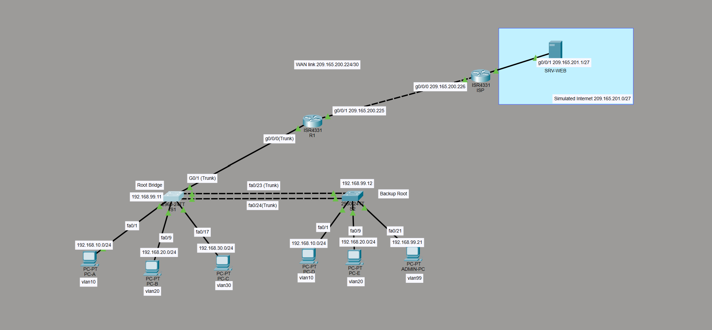

# Secure SME Network Design & Implementation

A small-to-medium enterprise (SME) network designed and implemented using Cisco Packet Tracer and physical Cisco networking equipment.

This project focuses on network segmentation, inter-VLAN communication, redundancy, network management, and Layer 2 security.

## 🛠 Technologies & Concepts

- Cisco Packet Tracer
- Cisco IOS
- VLAN Segmentation
- 802.1Q Trunking
- Router-on-a-Stick (ROAS)
- Inter-VLAN Routing
- DHCP
- LACP EtherChannel
- Spanning Tree Protocol (STP)
- Port Security
- PortFast & BPDU Guard
- SSH Remote Management
- Static & Default Routing

## 🎯 Project Objective

The objective of this project was to redesign a flat SME network into a segmented, manageable, and more secure network architecture.

The network separates Staff, Student, Guest, and Management traffic using VLANs while providing controlled Layer 3 connectivity through Router-on-a-Stick.

## 🌐 Network Design

| VLAN | Name | Purpose |
|------|------|---------|
| 10 | STAFF | Staff network |
| 20 | STUDENT | Student network |
| 30 | GUEST | Guest network |
| 99 | MANAGEMENT | Network device management |
| 100 | NATIVE | Native VLAN |
| 999 | BLACKHOLE | Unused ports |

## 👥 Project Context

This project was completed as part of an academic team assignment.  
The network was implemented and tested using both Cisco Packet Tracer and physical Cisco networking equipment.

Detailed configuration, verification results, troubleshooting experience, and my individual contributions are documented in this repository.

## 🗺 Network Topology

The network was designed and simulated using Cisco Packet Tracer before being implemented on physical Cisco networking equipment.

